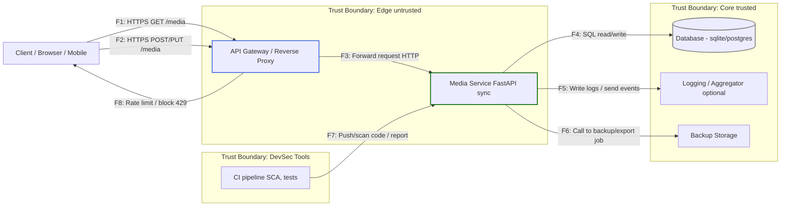

*выполнил: Лившиц Леонид, БПИ 235*

*Проект: "Media Catalog"*

## 1. Нефункциональные требования безопасности (NFR)

Все требования измеримы и проверяемы.

| ID     | Название                         | Описание                                  | Метрика / Порог                        | Проверка (чем / где)         | Компонент   | Приоритет |
| ------ | -------------------------------- | ----------------------------------------- | -------------------------------------- | ---------------------------- | ----------- | --------- |
| NFR-01 | Время ответа - чтение списка     | Время ответа для GET /media               | p95 <= 300 ms при 50 RPS               | Нагрузочный тест             | api         | High      |
| NFR-02 | Время ответа - запись/обновление | Время ответа для POST/PUT /media          | p95 <= 500 ms при 20 RPS               | Нагрузочный тест             | api         | High      |
| NFR-03 | Доступность сервиса              | Доступность приложения                    | SLA >= 99% в месяц                     | basic healthchecks           | infra/api   | High      |
| NFR-04 | Ошибки сервера (error rate)      | Доля 5xx ответов                          | <= 1% запросов в сутки                 | Лог-анализ / CI тесты        | api         | High      |
| NFR-05 | Уязвимости зависимостей (SCA)    | Время реакции на High/Critical уязвимости | устранение <= 7 дней                   | CI report                    | build       | High      |
| NFR-06 | Бэкапы БД                        | Резервные копии (для sqlite - экспорт)    | daily export; retention >= 7 days      | storage / scripts            | persistence | Medium    |
| NFR-07 | Логи и трассировка               | Ошибки содержат correlation_id            | 100% критичных ошибок с correlation_id | Лог-проверка                 | logging     | Medium    |
| NFR-08 | Ограничение запросов             | Защита от всплесков                       | 100 RPS на IP, общий предел 500 RPS    | Нагрузочный тест             | gateway/api | Medium    |
| NFR-09 | Безопасность контейнеров         | Запуск без root прав                      | runAsNonRoot = true                    | Dockerfile + securityContext | deployment  | Medium    |

---

## 2. DFD

---

## 3. STRIDE

Таблица: Поток/Элемент -> STRIDE категория -> Угроза (кратко) -> Контроль -> Ссылка на NFR

| Поток / Элемент | STRIDE | Угроза | Контроль (меры) | Ссылка на NFR |
|------------------|--------|--------|------------------|---------------|
| F1 (GET /media)  | D (DoS) | Спайк запросов от одного IP -> деградация сервиса | Rate-limiter на gateway, 429 при превышении | NFR-08 |
| F1 (GET /media)  | I (Info) | Информация в ответе содержит PII/чувств. данные | Валидация/фильтрация полей, контракты ответов | NFR-05 |
| F2 (POST/PUT)    | S (Spoofing) | Подмена клиента / фальсификация запроса (owner_id spoof) | Проверка owner привязки, X-Actor-Id парсер; авторизация в будущем | NFR-05 |
| F2 (POST/PUT)    | T (Tampering) | Изменение тела запроса (man-in-the-middle) | HTTPS only; request validation (Pydantic); input sanitization | NFR-05, NFR-04 |
| F3 (Gateway->Svc) | R (Repudiation) | Отсутствие trace-id -> трудно выяснить, кто что сделал | Добавить correlation_id, логирование каждой транзакции | NFR-07 |
| F4 (Svc->DB)      | T (Tampering) | SQL injection / некорректные запросы | ORM (prepared statements), input validation | NFR-05 |
| F4 (Svc->DB)      | D (DoS) | Большое число операций записи -> исчерпание ресурсов | Rate-limits для write; bulk-throttling | NFR-02, NFR-08 |
| F5 (Svc->Logs)    | I (Info) | Логи содержат чувств. данные или секреты | Маскирование PII, отказ от логирования секретов | NFR-07 |
| F6 (Backup)      | I (Info) | Утечка резервных копий | Шифрование экспорта, контролируемый доступ | NFR-06 |
| F7 (CI -> SVC)    | E (Elevation) | Зловредный артефакт в CI/пакете -> внедрение | SCA в CI, разрешения на deploy, review policies | NFR-05 |
| SVC deployment   | E (Elevation) | Контейнер запущен от root -> привилегии | runAsNonRoot, image scanning | NFR-09 |
| Gateway / TLS    | S (Spoofing) | Подмена endpoint (DNS/mitm) | HTTPS, HSTS, secure headers | NFR-01, NFR-02 |
                  |

---

## 4. Реализация мер и трассировка к NFR / угрозам

| Мера (ADR / PR)                      | Закрываемые угрозы                   | Ссылка на NFR  | Реализация                                                                                    |
| ------------------------------------ | ------------------------------------ | -------------- | --------------------------------------------------------------------------------------------- |
| ADR-001: RFC7807 - Problem Details   | Repudiation, InfoDisclosure (ошибки) | NFR-07, NFR-04 | Единный формат ошибок, correlation_id в ответах, tests/test_secure_coding.py                  |
| ADR-002: Validation & business rules | Tampering, Injection                 | NFR-02, NFR-04 | Pydantic схемы, бизнес-проверки (рейтинг только при status=done), unit и интеграционные тесты |
| ADR-003: Rate limiting middleware    | DoS, Brute-force                     | NFR-08, NFR-01 | Простая middleware, интеграционные тесты для throttling                                       |
| SCA in CI                            | Dependency compromise                | NFR-05         | CI job запускает SCA; критические фиксятся <=7 дней                                           |
| Backup scripts                       | Data loss / restore                  | NFR-06         | daily export скрипты для sqlite                                                               |

---

## 5. Регистр рисков (L x I)

Формат: RiskID | Описание | Связь (F / NFR) | L (1-5) | I (1-5) | Risk = L x I | Стратегия | Срок | Критерий закрытия

| RiskID | Описание | Связь | L | I | Risk | Стратегия | Срок | Критерий закрытия |
|--------|----------|-------|---:|---:|-----:|-----------|------|-------------------|
| R1 | DDoS / spike на GET /media приводит к деградации | F1 / NFR-01, NFR-08 | 3 | 4 | 12 | Снизить | 2025-10-20 | Load-test 50 RPS: p95 <= 300 ms; rate-limit включён |
| R2 | Спам POST/PUT приводит к перегрузке записи и порче БД | F2 / NFR-02, NFR-08 | 3 | 4 | 12 | Снизить | 2025-10-20 | Rate-limit для write; негативные тесты пройдены |
| R3 | Утечка чувствительных данных в логах | F5 / NFR-07 | 2 | 5 | 10 | Снизить | 2025-10-25 | Логи содержат не более разрешённых полей; маскирование включено |
| R4 | SQL injection через входные данные | F4 / NFR-05 | 2 | 5 | 10 | Снизить | 2025-10-18 | Unit/contract tests подтверждают валидацию; ORM используется |
| R5 | Критическая уязвимость в зависимостях | F7 / NFR-05 | 4 | 5 | 20 | Снизить / Избежать | 2025-10-14 | SCA в CI; High/Critical исправлены <= 7 дней |
| R6 | Утечка бэкапов или нешифрованный экспорт | F6 / NFR-06 | 2 | 4 | 8 | Снизить | 2025-11-01 | Экспорт шифруется; доступ по ACL |
| R7 | Низкая доступность из-за single-node развёртывания | infra / NFR-03 | 3 | 4 | 12 | Снизить | 2025-11-15 | Healthcheck + uptime probe; SLA >= 99% |
| R8 | Компрометация секретов в CI / неправильное хранение | CI / NFR-05, NFR-06 | 2 | 5 | 10 | Снизить | 2025-10-20 | Секреты в GitHub Secrets / Vault; audit enabled |
| R9 | Контейнер запущен с root-привилегиями | deployment / NFR-09 | 2 | 3 | 6 | Снизить | 2025-10-20 | Dockerfile: runAsNonRoot; image scan в CI |
| R10 | Повышенный процент 5xx ошибок (репутационный риск) | api / NFR-04 | 3 | 3 | 9 | Снизить / Принять | 2025-10-30 | Error rate <= 1% за 24ч; багфиксы и лог-ревью |
               |

---

## 6. Вывод / Заключение

1. NFR описаны и привязаны к проверяемым критериям.
2. DFD и STRIDE покрывают ключевые потоки и угрозы.
3. Внедрены основные меры: единый формат ошибок, строгая валидация, rate limiting, SCA и бэкапы.
